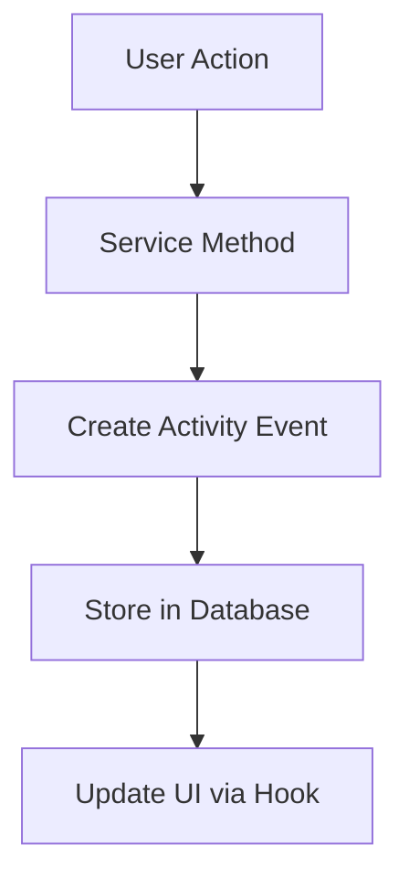

# ActivityTimeline Backend Integration Plan

## Overview
Connect the ActivityTimeline component to real backend data from `matter_events` and `session_audit_events` tables instead of using placeholder data.

## Current State
- ✅ Database schema exists (`matter_events`, `session_audit_events`)
- ❌ No API routes to fetch activity data
- ❌ No services to retrieve events
- ❌ ActivityTimeline uses hardcoded placeholder data
- ❌ No event creation when actions occur

## Implementation Plan

### Phase 1: Backend API Infrastructure

#### 1.1 Create Activity Service
**File:** `worker/services/ActivityService.ts`

```typescript
export interface ActivityEvent {
  id: string;
  type: 'matter_event' | 'session_event';
  eventType: string; // 'payment', 'status_change', 'document_added', etc.
  title: string;
  description: string;
  eventDate: string;
  actorType?: 'user' | 'lawyer' | 'system';
  actorId?: string;
  metadata?: Record<string, any>;
  createdAt: string;
}

export class ActivityService {
  constructor(private env: Env) {}

  async getMatterEvents(matterId: string): Promise<ActivityEvent[]>
  async getSessionEvents(sessionId: string): Promise<ActivityEvent[]>
  async getCombinedActivity(matterId?: string, sessionId?: string): Promise<ActivityEvent[]>
  async createEvent(event: Omit<ActivityEvent, 'id' | 'createdAt'>): Promise<string>
}
```

#### 1.2 Create Activity API Route
**File:** `worker/routes/activity.ts`

```typescript
// GET /api/activity?matterId=xxx&sessionId=xxx
// POST /api/activity (create new event)
export async function handleActivity(request: Request, env: Env): Promise<Response>
```

#### 1.3 Add Event Creation Points
Update existing services to create activity events:

- **PaymentService**: Create events for payment completion/failure
- **SessionService**: Create events for session milestones
- **Legal Intake Agent**: Create events for matter creation, status changes
- **File Upload Service**: Create events for all media types (images, videos, audio, documents, other files)
- **Message Handling**: Track when different media types are shared in conversations

### Phase 2: Frontend Integration

#### 2.1 Create Activity Hook
**File:** `src/hooks/useActivity.ts`

```typescript
export interface UseActivityOptions {
  matterId?: string;
  sessionId?: string;
  autoRefresh?: boolean;
  refreshInterval?: number;
}

export function useActivity(options: UseActivityOptions) {
  // Fetch activity events
  // Handle loading states
  // Provide refresh functionality
  // Return: { events, loading, error, refresh }
}
```

#### 2.2 Update ActivityTimeline Component
**File:** `src/components/ActivityTimeline.tsx`

```typescript
interface ActivityTimelineProps {
  matterId?: string;
  sessionId?: string;
  className?: string;
}

// Remove hardcoded data
// Use useActivity hook
// Handle loading/error states
// Display real events with proper formatting
```

#### 2.3 Add Activity to App Layout
**File:** `src/components/AppLayout.tsx`

```typescript
// Pass matterId/sessionId to ActivityTimeline
// Handle case when no matter/session exists
```

### Phase 3: Event Types & Mapping

#### 3.1 Define Event Types
```typescript
export const EVENT_TYPES = {
  // Matter Events
  MATTER_CREATED: 'matter_created',
  MATTER_STATUS_CHANGED: 'matter_status_changed',
  LAWYER_ASSIGNED: 'lawyer_assigned',
  PAYMENT_COMPLETED: 'payment_completed',
  PAYMENT_FAILED: 'payment_failed',
  
  // Media Events (comprehensive file type tracking)
  IMAGE_ADDED: 'image_added',
  VIDEO_ADDED: 'video_added', 
  AUDIO_ADDED: 'audio_added',
  DOCUMENT_ADDED: 'document_added',
  FILE_ADDED: 'file_added', // for "other" category files
  
  // Link Events (if implemented)
  LINK_SHARED: 'link_shared',
  
  // Session Events
  SESSION_STARTED: 'session_started',
  CONTACT_INFO_PROVIDED: 'contact_info_provided',
  INTAKE_COMPLETED: 'intake_completed',
  REVIEW_REQUESTED: 'review_requested',
} as const;
```

#### 3.2 Event Icon Mapping
```typescript
export const EVENT_ICONS = {
  [EVENT_TYPES.MATTER_CREATED]: ClockIcon,
  [EVENT_TYPES.CONTACT_INFO_PROVIDED]: UserIcon,
  [EVENT_TYPES.PAYMENT_COMPLETED]: CreditCardIcon,
  [EVENT_TYPES.LAWYER_ASSIGNED]: UserPlusIcon,
  [EVENT_TYPES.MATTER_STATUS_CHANGED]: ChatBubbleLeftRightIcon,
  
  // Media Events
  [EVENT_TYPES.IMAGE_ADDED]: PhotoIcon,
  [EVENT_TYPES.VIDEO_ADDED]: VideoCameraIcon,
  [EVENT_TYPES.AUDIO_ADDED]: MusicalNoteIcon,
  [EVENT_TYPES.DOCUMENT_ADDED]: DocumentTextIcon,
  [EVENT_TYPES.FILE_ADDED]: DocumentIcon,
  [EVENT_TYPES.LINK_SHARED]: LinkIcon,
  
  // Session Events
  [EVENT_TYPES.SESSION_STARTED]: ClockIcon,
  [EVENT_TYPES.INTAKE_COMPLETED]: CheckCircleIcon,
  [EVENT_TYPES.REVIEW_REQUESTED]: ChatBubbleLeftRightIcon,
} as const;
```

### Phase 4: Data Flow & Integration Points

#### 4.1 Event Creation Flow


#### 4.2 Integration Points
1. **Payment Completion**: `PaymentService.completePayment()` → Create payment event
2. **Matter Creation**: `LegalIntakeAgent.createMatter()` → Create matter_created event
3. **Status Changes**: `ReviewService.processReview()` → Create status_change event
4. **File Upload**: `FileService.uploadFile()` → Create specific media event based on file category:
   - Images (JPEG, PNG, GIF, etc.) → `image_added` event
   - Videos (MP4, WebM, etc.) → `video_added` event  
   - Audio (MP3, WAV, etc.) → `audio_added` event
   - Documents (PDF, DOC, etc.) → `document_added` event
   - Other files → `file_added` event
5. **Contact Form**: `ContactIntakeOrchestrator.submitForm()` → Create contact_info_provided event
6. **Message Handling**: Track media sharing in conversations using existing `mediaAggregation.ts` logic

### Phase 5: UI/UX Enhancements

#### 5.1 Loading States
- Skeleton loader for timeline items
- Progressive loading (show recent events first)
- Error states with retry functionality

#### 5.2 Event Formatting
- Relative timestamps ("2 hours ago", "Yesterday")
- Rich descriptions with context and file names:
  - "Image added: profile_photo.jpg"
  - "Video added: deposition_recording.mp4" 
  - "Audio added: voicemail_message.wav"
  - "Document added: employment_contract.pdf"
  - "File added: case_notes.txt"
- Clickable events (link to relevant documents/actions)
- Grouping by date
- File type-specific icons and styling

#### 5.3 Real-time Updates
- WebSocket connection for live updates
- Polling fallback for activity refresh
- Optimistic updates for user actions

## Implementation Order

### Week 1: Backend Foundation
1. Create `ActivityService.ts` with comprehensive media event support
2. Create `/api/activity` route
3. Add event creation to existing services with file type categorization
4. Integrate with existing `mediaAggregation.ts` logic for file categorization
5. Test with sample data across all media types

### Week 2: Frontend Integration
1. Create `useActivity` hook
2. Update `ActivityTimeline` component to handle all media types
3. Remove placeholder data
4. Add loading/error states
5. Implement file type-specific icons and descriptions

### Week 3: Polish & Testing
1. Add event type mappings
2. Implement proper formatting
3. Add real-time updates
4. Comprehensive testing

## Database Queries

### Get Matter Events
```sql
SELECT 
  id,
  event_type,
  title,
  description,
  event_date,
  created_by_lawyer_id,
  metadata,
  created_at
FROM matter_events 
WHERE matter_id = ? 
ORDER BY event_date DESC, created_at DESC
```

### Get Session Events
```sql
SELECT 
  id,
  event_type,
  actor_type,
  actor_id,
  payload,
  created_at
FROM session_audit_events 
WHERE session_id = ? 
ORDER BY created_at DESC
```

### Combined Activity Query
```sql
-- Union of matter and session events with proper typing
SELECT 
  'matter_event' as type,
  id,
  event_type,
  title,
  description,
  event_date as event_date,
  created_by_lawyer_id as actor_id,
  'lawyer' as actor_type,
  metadata,
  created_at
FROM matter_events 
WHERE matter_id = ?

UNION ALL

SELECT 
  'session_event' as type,
  id,
  event_type,
  event_type as title,
  payload as description,
  created_at as event_date,
  actor_id,
  actor_type,
  json('{"payload": "' || payload || '"}') as metadata,
  created_at
FROM session_audit_events 
WHERE session_id = ?

ORDER BY event_date DESC, created_at DESC
```

## Testing Strategy

### Unit Tests
- `ActivityService` methods
- Event creation logic
- Data transformation functions

### Integration Tests
- API endpoint functionality
- Database queries
- Frontend hook behavior

### E2E Tests
- Complete activity timeline flow
- Real-time updates
- Error handling scenarios

## Success Metrics

1. **Functionality**: ActivityTimeline displays real events from database across all media types
2. **Performance**: Timeline loads within 500ms
3. **Accuracy**: Events are created for all major user actions including file uploads
4. **Media Coverage**: All supported file types (images, videos, audio, documents, other) are properly tracked
5. **UX**: Smooth loading states, error handling, and file type-specific visual indicators
6. **Maintainability**: Clean separation of concerns and integration with existing media aggregation logic

## Future Enhancements

1. **Event Filtering**: Filter by event type, date range, actor, media type
2. **Event Details**: Expandable event details with full context and media previews
3. **Event Actions**: Click to view related documents/actions, preview media files
4. **Media Previews**: Thumbnail previews for images/videos in timeline
5. **Export**: Export activity timeline as PDF with media references
6. **Notifications**: Real-time notifications for important events
7. **Analytics**: Activity metrics and insights by media type
8. **Link Tracking**: If link sharing is implemented, track and display link events

## Risk Mitigation

1. **Data Migration**: Ensure existing data is preserved
2. **Performance**: Index database tables properly
3. **Backwards Compatibility**: Maintain existing API contracts
4. **Error Handling**: Graceful degradation when events fail to load
5. **Security**: Validate event creation permissions
