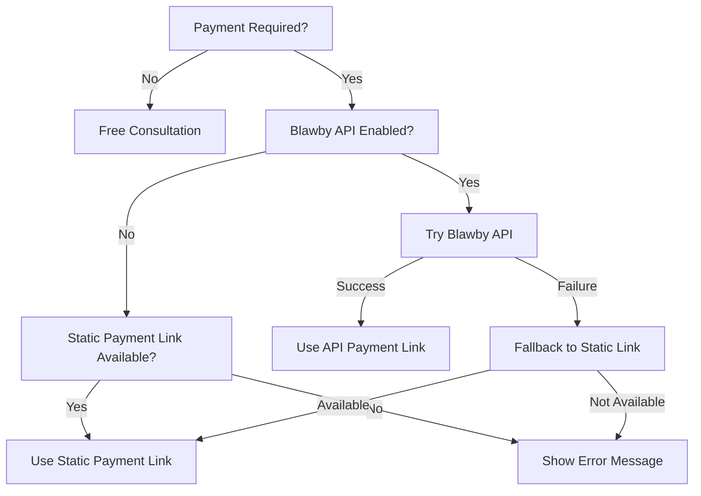

# Payment Integration Guide

This document explains how the payment integration works in the chatbot system, supporting both Blawby API integration and fallback payment methods.

## Overview

The system supports three payment scenarios:

1. **Blawby API Integration** - Full integration with staging.blawby.com for customer creation and invoice generation
2. **Static Payment Links** - Fallback for teams using other payment processors (Stripe, PayPal, etc.)
3. **No Payment Required** - Free consultations

## Payment Scenarios

### 1. Blawby API Integration (Recommended)

**Configuration:**
```json
{
  "requiresPayment": true,
  "consultationFee": 75,
  "paymentLink": "https://app.blawby.com/team/pay?amount=7500", // Fallback
  "blawbyApi": {
    "enabled": true,
    "apiKey": "your-api-key",
    "teamUlid": "your-team-ulid"
  }
}
```

**How it works:**
- Creates customer in staging.blawby.com
- Generates invoice with real payment link
- Falls back to static payment link if API fails
- Provides seamless integration with Laravel app

**Benefits:**
- Real customer creation and invoice generation
- Automatic payment tracking
- Integrated with staging.blawby.com workflow
- Fallback support for reliability

### 2. Static Payment Links (Fallback)

**Configuration:**
```json
{
  "requiresPayment": true,
  "consultationFee": 100,
  "paymentLink": "https://stripe.com/pay/example-payment-link",
  "blawbyApi": {
    "enabled": false,
    "apiKey": null,
    "teamUlid": null
  }
}
```

**How it works:**
- Uses pre-configured payment link
- No customer creation in staging.blawby.com
- Simple and reliable
- Works with any payment processor

**Use cases:**
- Teams using Stripe, PayPal, or other processors
- Teams without Blawby API access
- Simple payment workflows

### 3. No Payment Required

**Configuration:**
```json
{
  "requiresPayment": false,
  "consultationFee": 0,
  "paymentLink": null,
  "blawbyApi": {
    "enabled": false,
    "apiKey": null,
    "teamUlid": null
  }
}
```

**How it works:**
- No payment processing
- Direct matter submission to legal team
- Free consultations

## Payment Flow Logic



## Configuration Examples

### Team with Blawby API Integration
```json
{
  "id": "01jq70jnstyfzevc6423czh50e",
  "slug": "north-carolina-legal-services",
  "name": "North Carolina Legal Services",
  "config": {
    "consultationFee": 75,
    "requiresPayment": true,
    "paymentLink": "https://app.blawby.com/northcarolinalegalservices/pay?amount=7500",
    "blawbyApi": {
      "enabled": true,
      "apiKey": "your-api-key",
      "teamUlid": "01jq70jnstyfzevc6423czh50e"
    }
  }
}
```

### Team with Static Payment Link
```json
{
  "id": "01example-team",
  "slug": "example-static-payment-team",
  "name": "Example Team",
  "config": {
    "consultationFee": 100,
    "requiresPayment": true,
    "paymentLink": "https://stripe.com/pay/example-payment-link",
    "blawbyApi": {
      "enabled": false,
      "apiKey": null,
      "teamUlid": null
    }
  }
}
```

### Free Consultation Team
```json
{
  "id": "01free-team",
  "slug": "free-consultation-team",
  "name": "Free Consultation Team",
  "config": {
    "consultationFee": 0,
    "requiresPayment": false,
    "paymentLink": null,
    "blawbyApi": {
      "enabled": false,
      "apiKey": null,
      "teamUlid": null
    }
  }
}
```

## Error Handling

### Blawby API Failures
- **API Error**: Falls back to static payment link
- **No Fallback**: Shows error message to user
- **Network Issues**: Graceful degradation

### Static Payment Link Issues
- **Invalid Link**: Shows error message
- **No Link Configured**: Shows error message

### General Payment Errors
- Clear error messages to users
- Logging for debugging
- Graceful degradation

## Debugging

### Payment Method Detection
The system logs the payment method used:
- `blawby_api` - Blawby API integration
- `fallback_link` - Static link after API failure
- `static_link` - Static link only
- `none` - No payment required

### Log Examples
```
🔍 [DEBUG] Payment configuration check: {
  requiresPayment: true,
  consultationFee: 75,
  hasPaymentLink: true,
  blawbyApiEnabled: true,
  hasBlawbyApiKey: true,
  useBlawbyApi: true
}

✅ Blawby API invoice created successfully: {
  invoiceUrl: "https://staging.blawby.com/pay/...",
  paymentId: "01k1fe6x5ebqe7ewbjkezdkd5b"
}

💰 [DEBUG] Payment method used: blawby_api
```

## Best Practices

### For Blawby API Integration
1. Always provide a fallback `paymentLink`
2. Test API connectivity regularly
3. Monitor API response times
4. Keep API keys secure

### For Static Payment Links
1. Use reliable payment processors
2. Test payment links regularly
3. Provide clear payment instructions
4. Monitor payment success rates

### For Free Consultations
1. Set `requiresPayment: false`
2. Set `consultationFee: 0`
3. Remove `paymentLink` and `blawbyApi` configs

## Security Considerations

1. **API Keys**: Store securely in environment variables or team config
2. **Payment Links**: Use HTTPS and secure payment processors
3. **Error Messages**: Don't expose sensitive information
4. **Logging**: Avoid logging sensitive payment data

## Troubleshooting

### Common Issues

1. **"Payment processing not configured"**
   - Check `requiresPayment` and `consultationFee` settings
   - Verify `paymentLink` or `blawbyApi` configuration

2. **"Unable to generate payment link"**
   - Check Blawby API connectivity
   - Verify API key and team ULID
   - Check fallback payment link

3. **"No payment method available"**
   - Configure either `blawbyApi` or `paymentLink`
   - Set `requiresPayment: false` for free consultations

### Debugging Steps

1. Check team configuration in database
2. Review payment method logs
3. Test API connectivity
4. Verify payment link accessibility
5. Check error messages in logs 